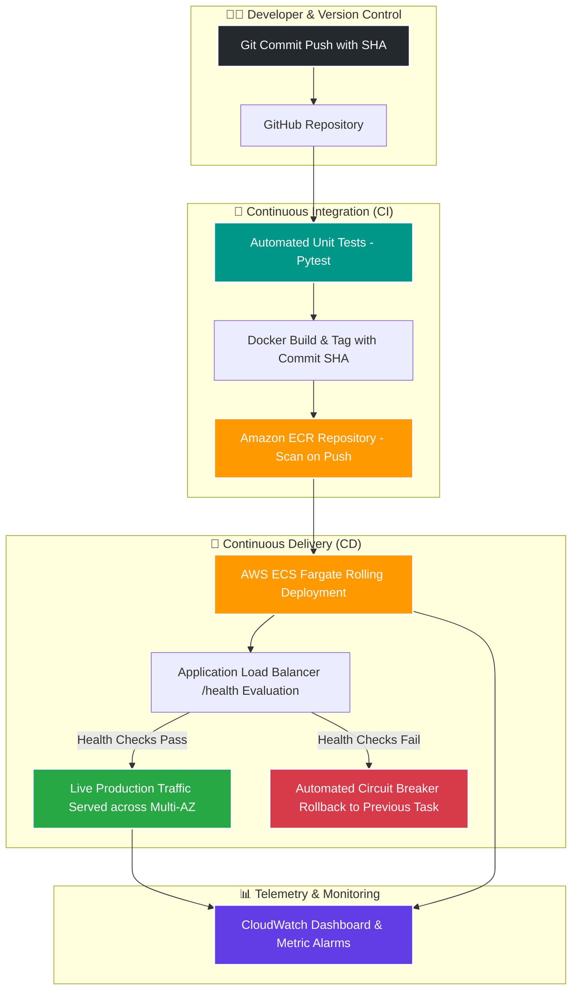

# 🚢 Container Delivery & Platform Engineering System
### Production-Grade ECS Fargate + Terraform + AWS CodeBuild / GitHub Actions CI/CD

[](https://www.terraform.io/)
[](https://aws.amazon.com/ecs/)
[](https://www.docker.com/)
[](https://aws.amazon.com/codepipeline/)
[](https://fastapi.tiangolo.com/)

A dedicated platform-engineering system designed to automate the entire software delivery lifecycle: from developer Git commit to automated unit testing, immutable container image builds, vulnerability scanning in Amazon ECR, zero-downtime rolling deployment to **AWS ECS Fargate**, and **automated deployment circuit breakers with instant rollback**.

---

## 🏗️ Architecture & Delivery Highway



---

## 🌟 Key Platform Capabilities

1. **Immutable Release Versioning:** Every build is tagged with its unique **Git Commit SHA**, providing 1-to-1 traceability from running ECS tasks back to the GitHub commit.
2. **Zero-Downtime Rolling Deployments:** ECS maintains a minimum 100% healthy capacity while launching new containers up to 200% before terminating old tasks.
3. **Automated Deployment Circuit Breakers:** Pushing a broken build or failing health check triggers an automated rollback to the last stable release with zero user downtime.
4. **Multi-AZ Infrastructure as Code:** Terraform provisions a Multi-AZ VPC, Public & Private Subnets, NAT Gateway, Security Groups, ECR, ALB, and ECS Fargate.
5. **Dual Pipeline Support:** Integrated with both **AWS CodeBuild / CodePipeline** (`buildspec.yml`) and **GitHub Actions** (`.github/workflows/deploy.yml`).
6. **Full Telemetry:** Real-time CloudWatch Dashboard tracking deployment request volumes, target latency, healthy vs unhealthy replicas, and CPU/Memory utilization.

---

## 📂 Repository Layout

```
├── app/                        # Application Source & Tests
│   ├── main.py                 # FastAPI microservice with release tracing & chaos toggles
│   ├── test_main.py            # Automated Pytest suite (runs in CI before build)
│   ├── requirements.txt        # Runtime dependencies
│   └── Dockerfile              # Multi-stage non-root container configuration
│
├── terraform/                  # Infrastructure as Code
│   ├── main.tf                 # Provider setup & constraints
│   ├── variables.tf            # Configurable inputs & CIDRs
│   ├── terraform.tfvars        # Environment variable overrides
│   ├── vpc.tf                  # Multi-AZ VPC (Public & Private subnets across 2 AZs)
│   ├── security_groups.tf      # Layered least-privilege firewall rules
│   ├── ecr.tf                  # Container registry with vulnerability scans & expiry rules
│   ├── alb.tf                  # Application Load Balancer & /health target group
│   ├── iam.tf                  # ECS Task Execution, CodeBuild & CodePipeline IAM roles
│   ├── ecs.tf                  # ECS Fargate Cluster, Task Def, Service & Circuit Breakers
│   ├── codepipeline.tf         # S3 artifact storage & AWS CodeBuild project
│   ├── cloudwatch.tf           # Real-time deployment dashboard & 5XX metric alarms
│   └── outputs.tf              # DNS URL, ECR URL, and telemetry outputs
│
├── docs/                       # Engineering Documentation & Portfolio Assets
│   ├── LEARNING_GUIDE.md       # 📘 Complete beginner guide, analogies & interview prep
│   ├── runbook.md              # Operations, release tracing & chaos rollback drills
│   └── ADR.md                  # Architecture Decision Records
│
├── .github/workflows/
│   └── deploy.yml              # GitHub Actions CI/CD Pipeline
│
├── buildspec.yml               # AWS CodeBuild Pipeline Specification
└── README.md                   # Project overview & documentation
```

---

## 🚀 Quickstart Deployment Guide

### Prerequisites
- [AWS CLI v2](https://aws.amazon.com/cli/) configured (`aws configure`)
- [Terraform >= 1.5.0](https://developer.hashicorp.com/terraform/install)
- [Docker](https://www.docker.com/)

---

### Step 1: Run Automated Tests Locally
```powershell
python -m pytest app/test_main.py -v
```

---

### Step 2: Initialize & Provision ECR Repository
```powershell
cd terraform
terraform init
terraform apply -target="aws_ecr_repository.app" -auto-approve
```

---

### Step 3: Build & Push Initial Container Image

#### 🪟 Windows (PowerShell):
```powershell
$ACCOUNT_ID = (aws sts get-caller-identity --query Account --output text)
$REGION = "us-east-1"
$password = aws ecr get-login-password --region $REGION
docker login -u AWS -p $password "$ACCOUNT_ID.dkr.ecr.$REGION.amazonaws.com"

# Build with embedded commit hash
docker build --build-arg GIT_COMMIT_SHA=initial-build -t container-platform-app ../app
docker tag container-platform-app:latest "$ACCOUNT_ID.dkr.ecr.$REGION.amazonaws.com/container-platform-app:latest"
docker push "$ACCOUNT_ID.dkr.ecr.$REGION.amazonaws.com/container-platform-app:latest"
```

---

### Step 4: Deploy Complete Cloud Infrastructure
```powershell
terraform apply -auto-approve
```

---

### Step 5: Verify Live Release & Telemetry
```powershell
$ALB = (terraform output -raw alb_dns_name)

# 1. Check live deployment metadata (Git Commit SHA & Uptime)
Invoke-RestMethod -Uri "$ALB/version"

# 2. View interactive OpenAPI documentation
# Open in browser: $ALB/docs
```

---

## 🧹 Teardown
To destroy all provisioned cloud resources and prevent ongoing AWS charges:
```powershell
terraform destroy -auto-approve
```

---

## 👨‍💻 Author
- **GitHub:** [@tahirkhan05](https://github.com/tahirkhan05)
